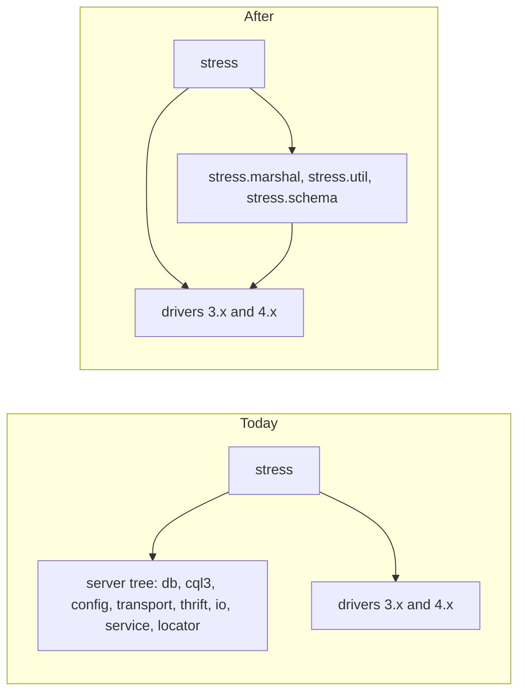
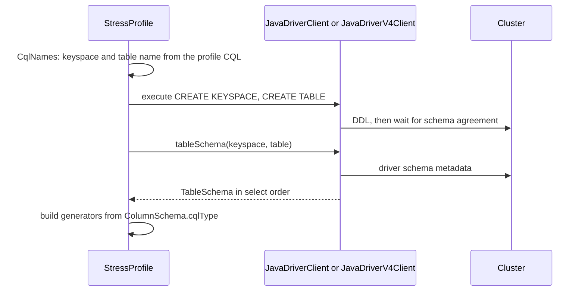

# QATOOLS-123 — Remove the vendored Cassandra source from cassandra-stress

**Date**: 2026-09-30

## Design drivers

- Generated data stays byte-identical. `PartitionIterator` seeds each row from the serialized key bytes (`seed(type.decompose(object), ...)`). A new release must validate data that an old release wrote, so every serializer keeps its byte format.
- The column order of a user profile stays the same. Generators bind to columns in `CFMetaData.allColumnsInSelectOrder()` order: partition keys, clustering keys, then static and regular columns by name.
- A command line that uses a removed option fails at argument parsing, before stress connects to the cluster. It does not run with part of its options ignored.
- The Gradle move follows in a second pull request. The Ant build keeps to plain Maven coordinates plus the driver 4.x shade, so the Gradle build can copy the dependency list as-is.

## Goals

- Stress, its helpers and its tests are the only Java source in the repository.
- The helpers that stress needs move under `org.apache.cassandra.stress`, rewritten or trimmed from the Cassandra originals.
- `StressProfile` reads the table schema from the cluster through the driver.
- `-mode` keeps `native` (driver 3.x) and `native 4x` (driver 4.x) only.
- The JMX collector is removed. The GC fields print zero.
- `build.xml` declares only the direct dependencies of stress, about 15 of the roughly 100 coordinates it declares today, and keeps only the targets that CI, the Makefile, the Dockerfile and packaging call.
- The Ant build compiles with `--release 21` on JDK 21, 25 and 27. CI runs the build, the stress unit tests and the integration tests on that JDK matrix.

## Non-goals

- The Gradle build (the second pull request).
- New Java features in stress code, or a `--release` above 21.
- A rename of the `org.apache.cassandra.stress` package or of the main class.
- Changes to workloads, generators, distributions, or the output format.
- A new JDK for the Docker runtime image, the deb and rpm packages, or `release.yml`.
- Replacements for the removed modes: Thrift, `simplenative`, offline SSTable writing, `CompactionStress`, and JMX.
- New tests beyond the four stress unit tests that exist today.
- Performance tuning. The integration tests prove correctness only.

## Design

The stress tree stops at its own package boundary. Everything it used from the server tree is either removed with the feature that needed it, or rewritten under `org.apache.cassandra.stress`.



| Server dependency | Used by | Result |
|---|---|---|
| `thrift.*`, `interface/thrift/gen-java` | Thrift mode | Removed |
| `transport.SimpleClient`, `ResultMessage` | `simplenative` mode | Removed |
| `db.ColumnFamilyStore`, `io.sstable.StressCQLSSTableWriter` | offline `SchemaInsert`, `CompactionStress` | Removed |
| `tools.NodeProbe` | `JmxCollector` | Removed |
| `db.marshal.*`, `serializers.*` | generators, `PartitionIterator` | Ported to `stress.marshal`, byte format unchanged |
| `CFMetaData`, `ColumnDefinition`, `CqlParser`, `QueryProcessor` | `StressProfile` | Replaced by driver metadata and `stress.schema` |
| `AbstractReplicationStrategy`, `CFMetaData.createCompactionStrategy` | `OptionReplication`, `OptionCompaction` | Replaced by the `ReplicationStrategy` and `CompactionStrategy` allow-lists, with the same accepted names |
| `DatabaseDescriptor.clientInitialization` | `Stress` | Removed |
| `ByteBufferUtil`, `FBUtilities`, `Pair`, `UUIDGen`, `MurmurHash`, `DynamicList`, `LockedDynamicList`, `ConsistencyLevel`, `EncryptionOptions`, `SSLFactory`, `FileUtils` | many | Trimmed copies in `stress.util` |
| `WindowsTimer`, `NamedThreadFactory` | `Stress`, `StressAction` | Removed, or replaced with JDK classes |

A user profile gets its schema from the cluster after stress creates the keyspace and the table:



| Condition | Behavior |
|---|---|
| The table is missing from driver metadata after the DDL | Wait for schema agreement and read the metadata again. Stop with an error that names the keyspace and the table after the request timeout |
| The profile has no `table_definition` | Read the existing table from the cluster, as today |
| `-schema replication(strategy=X)` or `compaction(strategy=X)` names no known strategy | Stop at argument parsing: `Invalid replication strategy: X` or `Invalid compaction strategy: X`, as today |
| A column type has no `stress.marshal` type | Stop before the run with an error that names the column and the CQL type |
| `-mode thrift`, `-mode cql3 simplenative` | Stop at argument parsing: `Mode <name> was removed. Use -mode native or -mode native 4x.` |
| `-port jmx=`, `-port thrift=`, `-transport factory=` | Stop at argument parsing with the usual unknown-option error |
| `-mode native` with no JMX | GC columns and `Total GC` lines print zero, as when JMX fails today |

### Build and dependencies

`build.xml` declares only the dependencies that stress code imports, plus the logging and compression jars that the drivers load at run time. The resolver brings the transitive dependencies from the driver POMs. Nothing pins a transitive jar by hand, so Renovate tracks each declared version. One POM, `cassandra-stress`, replaces the `parent`, `all` and `thrift` POMs.

| Scope | Coordinates | Reason |
|---|---|---|
| runtime | `com.scylladb:scylla-driver-core` 3.x | `-mode native` |
| runtime | `com.scylladb:java-driver-core` 4.x, shaded by jarjar | `-mode native 4x` |
| runtime | `com.google.guava:guava` | stress and `stress.util` |
| runtime | `org.apache.commons:commons-math3` | distributions |
| runtime | `org.apache.commons:commons-lang3`, `commons-cli:commons-cli` | settings, legacy options |
| runtime | `org.yaml:snakeyaml` | user profiles |
| runtime | `com.googlecode.json-simple:json-simple` | JSON report |
| runtime | `org.jctools:jctools-core` | work queues |
| runtime | `io.netty:netty-common`, at the version of the 3.x driver | `io.netty.util` imports |
| runtime | `org.slf4j:slf4j-api`, `ch.qos.logback:logback-classic` | driver logging, `conf/logback.xml` |
| runtime | `org.lz4:lz4-java`, `org.xerial.snappy:snappy-java` | `compression=lz4\|snappy` |
| test | `junit:junit` 4, `org.hamcrest:hamcrest` | the four stress tests |
| build | `maven-resolver-ant-tasks`, jarjar | resolve, shade |

Every other coordinate goes. This covers `cassandra-all`, `cassandra-thrift`, `libthrift`, `thrift-server`, antlr and ST4, ecj and jdt, jamm, sigar, ohc, byteman, byte-buddy, asm, jmh, quicktheories, `dtest-api`, hadoop, mockito, assertj, caffeine, hppc, `high-scale-lib`, `stream`, `concurrent-trees`, `snowball-stemmer`, airline, `reporter-config3`, `metrics-jvm`, `metrics-logback`, jnr, jna, zstd, `compress-lzf`, fastutil, jbcrypt, `hibernate-validator`, reflections, the jackson jars, log4j and the slf4j bridges, commons-codec, commons-io, commons-logging, httpclient, joda-time, HdrHistogram, `compile-command-annotations` and the legacy `maven-ant-tasks`.

`build.xml` keeps these targets: `init`, `clean`, `realclean`, the resolver targets, `java-driver-core.get`, `java-driver-core.shade`, `scylla-driver-core.override`, `build`, `jar`, `artifacts`, `build-test`, `testold` and `testsome`. CI, the Makefile, the Dockerfile and packaging call these. All other targets go, with the properties that only they read: `gen-cql3-grammar`, `gen-thrift-java`, `gen-thrift-py`, `maven-ant-tasks-*`, `test-run`, `test-cdc`, `msg-ser-*`, `cql-test*`, `test-jvm-*`, `mvn-install` and `generate-idea-files`. `<javac>` sets `release="21"` and `-proc:none`, and takes no `--add-exports` or `--add-opens` flag. `conf/jvm-clients.options` keeps only the flags that the drivers need at run time. The integration tests on JDK 25 and 27 decide that list.

These files leave the repository with the code that used them: `interface/`, `src/antlr/`, `src/gen-java/`, `src/java/com/datastax/`, `test/distributed`, `test/long`, `test/burn`, `test/microbench`, `test/data`, the non-stress tests in `test/unit`, `.build/dependency-check-suppressions.xml`, `eclipse_compiler.properties`, `ide/idea-iml-file.xml`, `NEWS.txt` and `README-cassandra.asc`. `ide/idea/` stays, because the Java standard reads its code style.

## Contracts

### Inputs

```
driver 3.x: Cluster.getMetadata().getKeyspace(ks).getTable(t)            # partitionKey, clusteringColumns, columns, type
driver 4.x: Session.getMetadata().getKeyspace(ks).flatMap(k -> k.getTable(t))  # getPartitionKey, getClusteringColumns, getColumns, getType
```

### Outputs

The command line, after this change:

```
-mode native [4x] cql3 [prepared|unprepared] [protocolVersion=N] [compression=none|lz4|snappy] [user= password= ...]
-port native=9042
-transport [truststore= keystore= ssl-protocol= ssl-ciphers= ...]
```

The interval and summary output keep today's header, including the GC fields:

```
type, total ops, op/s, pk/s, row/s, mean, med, .95, .99, .999, max, time, stderr, errors, gc: #, max ms, sum ms, sdv ms, mb
```

The distribution keeps `bin/cassandra-stress`, `conf/`, `lib/` and the jar name. The launcher classpath drops `$classes/thrift`.

### Module API

```java
package org.apache.cassandra.stress.marshal;

public interface TypeSerializer<T> {
    ByteBuffer serialize(T value);
    T deserialize(ByteBuffer bytes);
    String toString(T value);
    Class<T> getType();
}

public abstract class AbstractType<T> {
    public abstract TypeSerializer<T> getSerializer();
    public ByteBuffer decompose(T value);
    public T compose(ByteBuffer bytes);
    public String getString(ByteBuffer bytes);
    public static AbstractType<?> parse(String cqlType);
}
```

```java
package org.apache.cassandra.stress.schema;

public record ColumnSchema(String name, String cqlType, Kind kind) {
    public enum Kind { PARTITION_KEY, CLUSTERING, STATIC, REGULAR }
}

public record TableSchema(String keyspace, String table, List<ColumnSchema> columnsInSelectOrder) {}

public interface SchemaSource {
    TableSchema tableSchema(String keyspace, String table);
}

public final class CqlNames {
    public static String keyspaceOf(String createKeyspaceCql);
    public static String tableOf(String createTableCql);
}
```

```java
package org.apache.cassandra.stress.settings;

public enum ReplicationStrategy {
    NetworkTopologyStrategy, EverywhereStrategy;
    public static String validate(String name);
}

public enum CompactionStrategy {
    SizeTieredCompactionStrategy, LeveledCompactionStrategy, TimeWindowCompactionStrategy,
    DateTieredCompactionStrategy, IncrementalCompactionStrategy;
    public static String validate(String name);
}
```

`CompactionStrategy` lists the compaction classes that the vendored tree holds today. `ReplicationStrategy` drops three: `SimpleStrategy`, which Scylla no longer supports, `LocalStrategy`, which only system keyspaces use, and `OldNetworkTopologyStrategy`, which Cassandra 4.0 removed. `-schema replication(strategy=X)` fails for these three. A profile that names one in its own `CREATE KEYSPACE` text still passes to the cluster unchanged. `validate` accepts the short name or the full name under `org.apache.cassandra.locator` or `org.apache.cassandra.db.compaction`. It returns the string that goes into the CQL, as today: `ReplicationStrategy` returns the full `org.apache.cassandra.locator.` name, and `CompactionStrategy` returns the name as given. A custom strategy class on the stress classpath is no longer accepted.

`JavaDriverClient` and `JavaDriverV4Client` implement `SchemaSource`. `columnsInSelectOrder` orders the partition keys and the clustering keys by position, then the static and regular columns by name, as `CFMetaData.allColumnsInSelectOrder()` does.

## Subtasks

None. One pull request carries this spec. The Gradle move is a second pull request under the same key.

## Risks

| Risk | Response |
|---|---|
| A ported serializer changes the bytes, and validation of old data fails | Port the serializer bodies as-is. The plan adds no new test, so the integration tests with `-mode native` and a user profile are the check. Compare generated keys against master on one profile before merge |
| Driver metadata orders columns differently from `CFMetaData` | `TableSchema` sorts by kind, position and name itself, and does not trust the driver order |
| SCT passes a removed option, such as `-mode thrift`, `-port jmx=` or `-transport factory=` | Search SCT for the removed options before merge, and change SCT first where it uses one |
| Without the hand-pinned transitive jars, the resolver picks other versions of Netty, Guava or Jackson for the drivers | Compare the `build/lib/jars` list against master in the plan. Pin a version only when the integration tests or a CVE require it |
| Netty in the drivers needs an `--add-opens` flag on JDK 25 or 27 | The integration tests run on the JDK matrix. Keep only the flags they show to be needed |
| No Temurin 27 image for `actions/setup-java` | Use the latest Temurin 27 early-access build, and mark that matrix entry `continue-on-error` until GA |
| The diff is too large to review | Remove files in separate commits (Thrift, simplenative, offline and JMX, server tree, server tests) before the rewrite commits |

## Deferred work

- The Gradle build. The source stays in `src/java` and `test/unit`, and the Gradle pull request moves it to `src/main/java` and `src/test/java`.
- Adoption of Java 25 or 27 features. That needs a `--release` bump and ends JDK 21 runtime support.

---

Files, internal functions, tests, and line numbers go to `plan.md`. On the
spike path the code diff carries them, and the spec keeps this shape. A spec
near 150 lines, diagrams included, reads in one sitting. Above that, consider
a split and propose it in the spec. This footer stays in every spec.
